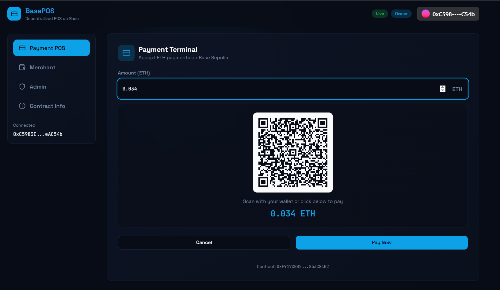
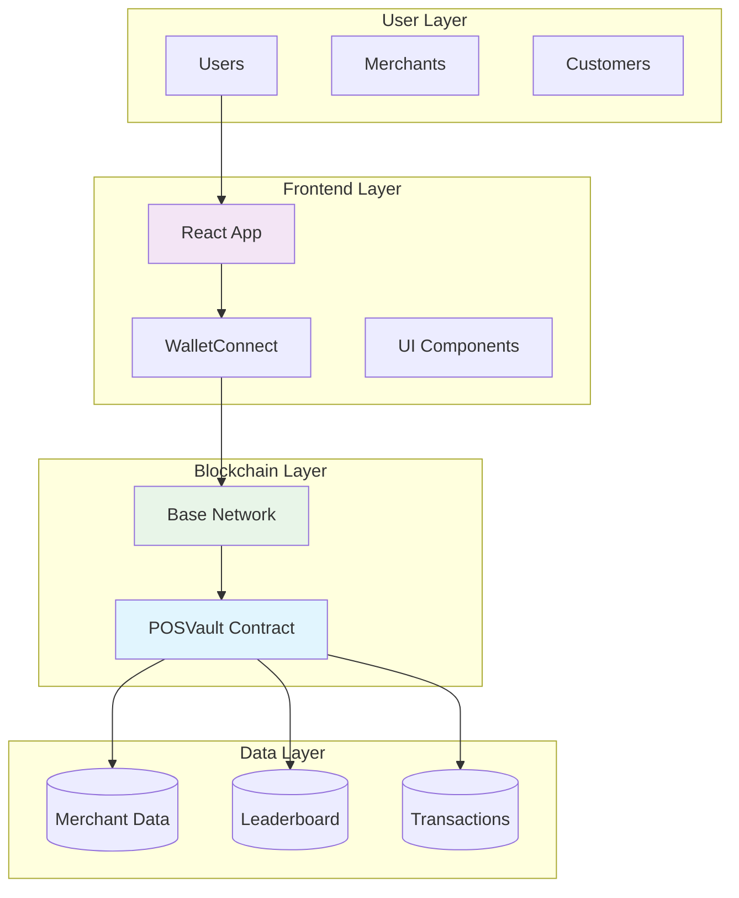
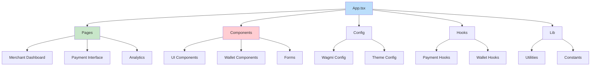
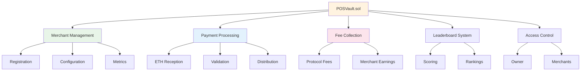
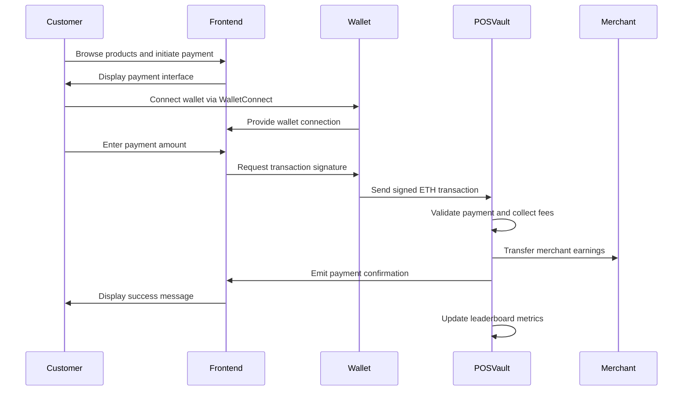

# Based-POS

[](https://soliditylang.org/)
[](https://base.org/)
[](https://walletconnect.com/)
[](https://reactjs.org/)
[](https://www.typescriptlang.org/)
[](https://vitejs.dev/)
[](https://opensource.org/licenses/MIT)

A comprehensive decentralized point-of-sale payment system built on the Base blockchain, featuring a secure payment vault smart contract and a modern React frontend with WalletConnect integration.

Streamline merchant-customer transactions with gas-optimized smart contracts, automated fee collection, leaderboard tracking, and seamless wallet connectivity.

---



## Table of Contents

- [Based-POS](#based-pos)
  - [Table of Contents](#table-of-contents)
  - [Overview](#overview)
  - [Key Features](#key-features)
    - [Merchant Features](#merchant-features)
    - [Payment Features](#payment-features)
    - [Security Features](#security-features)
    - [User Experience](#user-experience)
    - [Admin Security Center](#admin-security-center)
  - [System Architecture](#system-architecture)
  - [Frontend Architecture](#frontend-architecture)
  - [Contract Architecture](#contract-architecture)
  - [System Flow](#system-flow)
  - [Technology Stack](#technology-stack)
    - [Frontend](#frontend)
    - [Smart Contract](#smart-contract)
    - [Development Tools](#development-tools)
  - [Getting Started](#getting-started)
    - [Prerequisites](#prerequisites)
    - [Installation](#installation)
    - [Configuration](#configuration)
  - [For Developers](#for-developers)
    - [Contract Development](#contract-development)
    - [Frontend Development](#frontend-development)
    - [Project Structure](#project-structure)
  - [Deployment](#deployment)
    - [Contract Deployment](#contract-deployment)
    - [Frontend Deployment](#frontend-deployment)
  - [Testing](#testing)
    - [Contract Testing](#contract-testing)
    - [Frontend Testing](#frontend-testing)
  - [Contributing](#contributing)
    - [Development Guidelines](#development-guidelines)
  - [Security](#security)
  - [License](#license)

## Overview

Based-POS is a decentralized payment solution that revolutionizes point-of-sale transactions on the Base blockchain. The system consists of two main components:

1. **POSVault Smart Contract**: A secure, gas-optimized Solidity contract that handles ETH payments, merchant management, and protocol fee collection
2. **React Frontend**: A modern web application providing intuitive interfaces for merchants and customers with WalletConnect integration

The platform enables merchants to collect payments securely while earning protocol fees, and customers to make seamless blockchain payments through their preferred wallets.

## Key Features

### Merchant Features
- Multi-merchant support with individual vaults
- Automated protocol fee collection
- Leaderboard tracking and performance metrics
- Real-time transaction monitoring and analytics

### Payment Features
- Direct Ethereum payments on Base network
- WalletConnect integration supporting 200+ wallets
- Gas-optimized contract operations
- Instant transaction confirmations

### Security Features
- OpenZeppelin battle-tested contract libraries
- Role-based access control
- Reentrancy protection
- Comprehensive input validation

### User Experience
- Responsive, mobile-first design
- Dark/light theme support
- Intuitive Shadcn/ui component library
- Real-time transaction status updates

### Admin Security Center


## System Architecture



The system follows a layered architecture ensuring separation of concerns, scalability, and maintainability.

## Frontend Architecture



Built with modern React patterns, TypeScript, and Tailwind CSS for maintainable and scalable frontend code.

## Contract Architecture



The POSVault contract is built with OpenZeppelin standards ensuring security, reliability, and upgradeability.

## System Flow



This flow ensures secure, transparent, and efficient payment processing with real-time feedback.

## Technology Stack

### Frontend
- **Framework**: React 19 with TypeScript
- **Build Tool**: Vite 7
- **Styling**: Tailwind CSS with Shadcn/ui
- **State Management**: TanStack Query
- **Wallet Integration**: Wagmi + ConnectKit
- **Charts**: Recharts
- **Forms**: React Hook Form with Zod validation

### Smart Contract
- **Language**: Solidity ^0.8.24
- **Framework**: Foundry
- **Libraries**: OpenZeppelin Contracts 5.x
- **Network**: Base (Mainnet and Testnet)
- **Testing**: Forge with Solidity testing

### Development Tools
- **Package Manager**: npm/bun
- **Linting**: ESLint with TypeScript
- **Code Quality**: Prettier
- **Version Control**: Git

## Getting Started

### Prerequisites

- Node.js v18+ (for frontend development)
- Foundry (for smart contract development)
- Git
- A Web3 wallet (MetaMask, Coinbase Wallet, or any WalletConnect-compatible wallet)

### Installation

1. **Clone the repository**
   ```bash
   git clone <repository-url>
   cd based-pos
   ```

2. **Install frontend dependencies**
   ```bash
   npm install
   ```

3. **Install contract dependencies**
   ```bash
   cd contract-solidity
   forge install
   ```

### Configuration

1. **Environment Setup**
   ```bash
   cp .env.example .env
   # Configure your environment variables
   ```

2. **Contract Configuration**
   - Update deployment scripts in `contract-solidity/script/`
   - Configure network settings in `foundry.toml`

3. **Frontend Configuration**
   - Update Wagmi config in `src/config/wagmi.ts`
   - Configure theme settings if needed

## For Developers

### Contract Development

The smart contract is located in `contract-solidity/src/POSVault.sol`. Key development commands:

```bash
# Run tests
forge test

# Deploy to testnet
forge script script/DeployPOSVault.s.sol --rpc-url $BASE_SEPOLIA_RPC --broadcast

# Generate documentation
forge doc
```

### Frontend Development

```bash
# Start development server
npm run dev

# Build for production
npm run build

# Run linting
npm run lint

# Type checking
npx tsc --noEmit
```

### Project Structure

```
based-pos/
├── contract-solidity/     # Smart contract codebase
│   ├── src/              # Contract source files
│   ├── test/             # Contract tests
│   └── script/           # Deployment scripts
├── src/                  # Frontend source code
│   ├── components/       # Reusable UI components
│   ├── pages/           # Page components
│   ├── config/          # Configuration files
│   └── hooks/           # Custom React hooks
├── public/               # Static assets
└── README.md            # This file
```

## Deployment

### Contract Deployment

1. Configure your deployment network in `foundry.toml`
2. Update constructor parameters in deployment script
3. Run deployment:
   ```bash
   forge script script/DeployPOSVault.s.sol --rpc-url $RPC_URL --broadcast --verify
   ```

### Frontend Deployment

1. Build the application:
   ```bash
   npm run build
   ```

2. Deploy to your preferred hosting service (Vercel, Netlify, etc.)

## Testing

### Contract Testing

```bash
# Run all tests
forge test

# Run with gas reporting
forge test --gas-report

# Run specific test
forge test --match-test testPaymentProcessing
```

### Frontend Testing

```bash
# Run unit tests (when implemented)
npm run test

# E2E testing (when implemented)
npm run test:e2e
```

## Contributing

We welcome contributions from the community. Please follow these steps:

1. Fork the repository
2. Create a feature branch: `git checkout -b feature/amazing-feature`
3. Commit your changes: `git commit -m 'Add amazing feature'`
4. Push to the branch: `git push origin feature/amazing-feature`
5. Open a Pull Request

### Development Guidelines

- Follow the existing code style
- Write comprehensive tests for new features
- Update documentation as needed
- Ensure all tests pass before submitting PR

## Security

Security is paramount in blockchain applications. This project implements:

- Contract audits (recommended for production)
- Proper role-based access controls
- Comprehensive input validation
- Reentrancy protection
- Upgradeable contract patterns

For security concerns, please email security@based-pos.com

## License

This project is licensed under the MIT License - see the [LICENSE](LICENSE) file for details.

---

Built for the Base ecosystem. Empowering merchants and customers with decentralized payments.